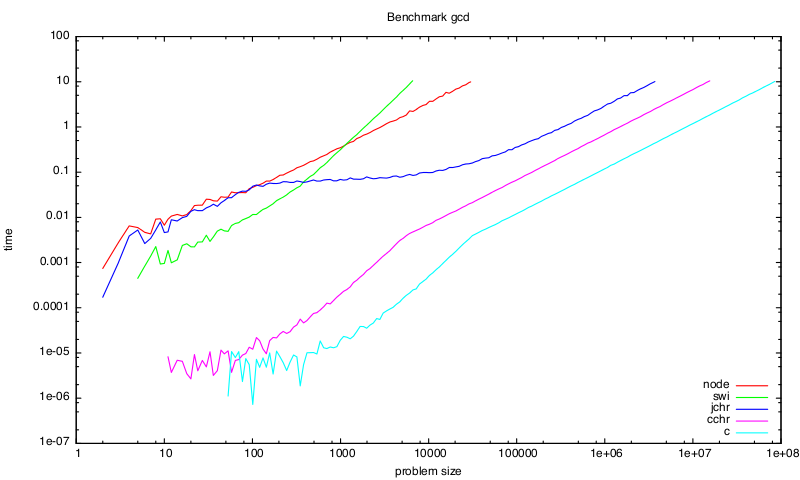

# CHR Benchmark Suite

Compare the execution runtimes of different implementations of [Constraint Handling Rules](https://about.chrjs.net/).



## CHR Systems

The following systems with CHR support are compared. With *CHR(X)* we denote a CHR system as extension of language *X*.

- CHR(Prolog): [SWI-Prolog](http://swi-prolog.org/), using [KU Leuven CHR](http://www.swi-prolog.org/pldoc/man?section=chr)
- CHR(C): [CCHR](https://svn.ulyssis.org/repos/sipa/cchr/)
- CHR(Java): [JCHR](https://dtai.cs.kuleuven.be/CHR/JCHR/)
- CHR(JavaScript): [CHR.js](http://github.com/fnogatz/CHR.js)

In addition to these systems we provide native C and JavaScript implementations of most of the given problems.

## Problems

The test cases are based on the paper ["CCHR: the fastest CHR Implementation, in C."](http://citeseerx.ist.psu.edu/viewdoc/download?doi=10.1.1.181.1214&rep=rep1&type=pdf) by Wuille, Schrijvers and Demoen (2007). The example problems are:

- __fib__: The bottom-up calculation of the Fibonacci numbers.
- __gcd__: The calculation of the greatest common divisor of two integers, based on the subtraction-based Euclidean algorithm.
- __leq__: A constraint solver for less-equal constraints between variables.
- __primes__: An implementation of the Sieve of Eratosthenes to generate prime numbers.
- __ram__: A simulator of a Random Access Machine.
- __tak__: Implementation of the Takeuchi function.

Due to different features of the examined CHR systems not all tests have been implemented for all systems.

## Makefile

The `Makefile` contains a large number of targets. For every *system* (`swi`, `jchr`, `cchr`, `chrjs` and native `c`) there are several sub-targets, in particular:

- `system.preinstall`: Installation of dependencies and benchmark setup, for example
the creation of temporary directories.
- `system.install`: Installs the actual system.
- `system.prepare`: Preparation tasks for the benchmarks. Usually this includes the
compilation of the test source files, for example compile `*.jchr` files for JCHR.
- `system.clean`: Target to delete temporary directories and files. This should be called
before the benchmark is executed.
- `system.test`: Runs each test once to check if it is executable. This will generally
create no output. The tests have been passed if no error occurs.
- `system.bench`: Executes the benchmarks for this system.

Apart from these tasks there are further, system dependent sub-targets, for example to
benchmark only a single system and single test case.

## Run Benchmarks

To install all given systems and prepare the benchmarks, run these two commands:

```bash
$ sudo make install
$ sudo make prepare
```

To start the benchmarks simply call `make bench`:

```bash
$ make bench
./bench.pl
## bench=leq
### sys=swi
swi/leq:1 (0,0.00186556577682495)*1696 exp
swi/leq:2 (0,0.00171436494731004)*1803 exp
swi/leq:3 (4.44119496322037e-05,0.00171436494731004)*1766 exp
...
```

There is no order in which systems and problems are tested, so `leq/swi` does not need to be the first.

Because the benchmark for all systems will due several hours, `make bench.save` should be preferred. It will create a `bench.out` file with the benchmark results.

## Plot Benchmark Results

The `bench.out` file can be used to create a plot with the benchmark results:

```
make plot
```

This will create the `/plots` directory containing a PDF for each problem, for example `/plots/bench-gcd-col.pdf`.

## Citation & Acknowledgements

If you use the CHR Benchmarks in a scientific publication, please cite it as described in [`CITATION`](CITATION).
